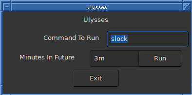

# Ulysses

A tool for creating simple [ulysses pacts](https://en.wikipedia.org/wiki/Ulysses_pact).
Let's say you know that you won't shutdown your computer when you finish doing something. This basically tells your future self too bad and runs a command anyways.
Inspired by advice in Atomic Habits.

The command and time amount are cached on the fs, so this makes it easy to run the same thing over and over.



Should work on most unixes.

To build:
```
git clone https://github.com/g-w1/ulysses
zigmod fetch
zig build -Drelease-safe # binary is in ./zig-out/bin/ulysses
```
